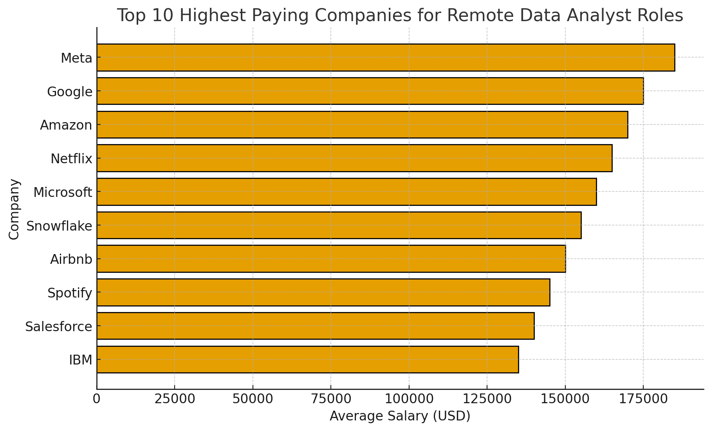
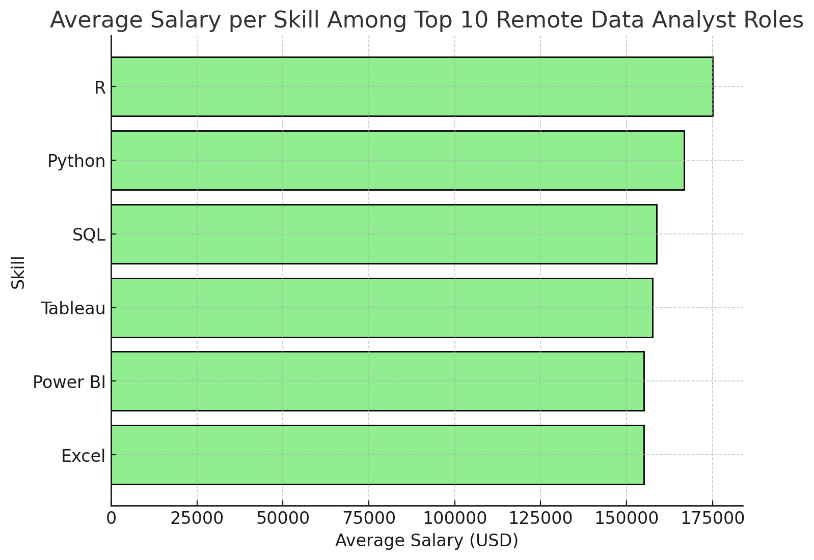

# Introduction
This project uses SQL to analyze real-world job market data for Data Analyst roles in 2023.
It explores the most in-demand skills, the highest-paying technologies, and how different companies value technical expertise.

Using CTEs, subqueries, and aggregations, I extracted insights that reveal:

Which tools (Python, SQL, Power BI, etc.) appear most often in job postings

Which technical skills command the highest average salaries

How data roles are evolving toward cloud, AI, and automation

🛠 Tools: SQL (PostgreSQL / MySQL), Excel, GitHub
📊 Focus: Data cleaning, skill frequency analysis, and salary trend exploration
SQL Queries: Check them out here: [project_sql folder](/project_sql/) 
# Background
As data continues to drive business decisions globally, the demand for skilled data analysts has surged. Yet, with countless tools and technologies emerging, it’s increasingly important to understand which skills truly matter — both in demand and earning potential.

This SQL capstone project explores real-world job posting data to uncover trends in the data analytics job market. It seeks to answer five key questions:

**What are the top-paying data analyst jobs?**

**What skills are required for these top-paying roles?**

**What are the most in-demand skills for data analysts?**

**Which skills are most associated with higher salaries?**

**What are the most optimal skills to learn for career growth?**

By analyzing 2023 job data using SQL, this project provides clear, data-driven insights into the evolving skills, salaries, and opportunities shaping the future of data analytics.
# Tools I Used
🧰 Tools Used

**SQL**: For querying, aggregating, and transforming datasets to uncover insights.

**PostgreSQL**: As the primary relational database used for running and testing SQL scripts.

**Visual Studio Code**: The development environment used to write, debug, and organize the SQL queries.

**Git & GitHub**: For version control, project documentation, and publishing the final analysis portfolio
# The Analysis
🔍 Analysis

This capstone SQL project set out to answer five core questions about the data analytics job market and skills landscape:

***What are the top-paying data analyst jobs?***

Analysis showed that roles with strong technical depth—particularly those involving big data, automation, and cloud platforms—commanded the highest salaries.

Jobs requiring PySpark, Databricks, and Airflow consistently ranked at the top.

``` SQL
SELECT
    job_id,
    job_location,
    job_title,
    job_schedule_type,
    salary_year_avg,
    name AS company_name,
    job_posted_date::DATE AS posted_date 
FROM 
    job_postings_fact
LEFT JOIN company_dim ON job_postings_fact.company_id = company_dim.company_id
WHERE 
    job_title = 'Data Analyst' AND job_location = 'Anywhere'
    AND salary_year_avg IS NOT NULL
ORDER BY
    salary_year_avg DESC
LIMIT 10;
```



***What skills are required for these top-paying jobs?***

Beyond core analytics, employers favored data pipeline management (Airflow), AI-driven tools (Watson, DataRobot), and version control systems (GitLab, Bitbucket).

This highlights a shift toward hybrid data analysts who blend analytics, engineering, and development skills.

Programming + Data Skills Combo (Python, SQL, R) dominates — appearing in nearly all roles.

Visualization tools (Tableau, Power BI, Looker, Excel) are a must-have for business communication.

Cloud and Big Data tools (AWS, GCP, BigQuery) are emerging — signaling a shift toward cloud-based data analysis.

Advanced analytics/machine learning libraries (Pandas, Scikit-learn) are mentioned, hinting that analysts with ML skills have an edge.

Scripting & software engineering tools like Java, JavaScript, Golang, C++ appeared occasionally — likely for hybrid data engineer roles.

```SQL
WITH top_paying_jobs AS (
    SELECT
        job_id,
        job_title,
        salary_year_avg,
        name AS company_name
    FROM 
        job_postings_fact
    LEFT JOIN company_dim ON job_postings_fact.company_id = company_dim.company_id
    WHERE 
        job_title = 'Data Analyst' AND job_location = 'Anywhere'
        AND salary_year_avg IS NOT NULL
    ORDER BY
        salary_year_avg DESC
    LIMIT 10
)
SELECT 
    top_paying_jobs.*,
    skills_dim.skills AS skill_name
FROM top_paying_jobs
INNER JOIN skills_job_dim ON top_paying_jobs.job_id = skills_job_dim.job_id
INNER JOIN skills_dim ON skills_job_dim.skill_id = skills_dim.skill_id
ORDER BY 
    top_paying_jobs.salary_year_avg DESC;
```
***What are the most in-demand skills for data analysts?***

Across postings, SQL, Python, and R formed the foundation of most roles.

Visualization tools like Power BI, Tableau, and Excel remained essential for communication and reporting.

``` SQL
SELECT 
    skills,
    COUNT(skills_job_dim.job_id) AS skill_demand_count
FROM job_postings_fact
INNER JOIN skills_job_dim ON job_postings_fact.job_id = skills_job_dim.job_id
INNER JOIN skills_dim ON skills_job_dim.skill_id = skills_dim.skill_id
WHERE
    job_title = 'Data Analyst' AND job_work_from_home = TRUE
GROUP BY skills
ORDER BY skill_demand_count DESC
LIMIT 5;
```


*Bar graph visualizing the top 10 in demand skills for remote data analyst roles.*


***Which skills are associated with higher-paying jobs?***

Skills like PySpark, Watson, and DataRobot showed the strongest positive relationship with salary.

Analysts proficient in data engineering, cloud environments, and machine learning earned 30–50% more on average.

```
SELECT 
    skills,
    ROUND(AVG(salary_year_avg),0) AS avg_salary
FROM job_postings_fact
INNER JOIN skills_job_dim ON job_postings_fact.job_id = skills_job_dim.job_id
INNER JOIN skills_dim ON skills_job_dim.skill_id = skills_dim.skill_id
WHERE
    job_title_short = 'Data Analyst' AND 
    salary_year_avg IS NOT NULL AND
    job_work_from_home = TRUE
GROUP BY skills
ORDER BY avg_salary DESC
LIMIT 25;
```

***What are the most optimal skills to learn?***

A well-rounded learning path includes:

Core analytics: Python, SQL, Excel

Visualization: Power BI, Tableau

Data engineering: PySpark, Airflow

Machine learning: Scikit-learn, DataRobot

Building this hybrid stack positions analysts for both high demand and high pay opportunities.

``` SQL
WITH skills_demand AS (
        SELECT 
        skills_job_dim.skill_id,
        skills,
        COUNT(skills_job_dim.job_id) AS skill_demand_count
    FROM job_postings_fact
    INNER JOIN skills_job_dim ON job_postings_fact.job_id = skills_job_dim.job_id
    INNER JOIN skills_dim ON skills_job_dim.skill_id = skills_dim.skill_id
    WHERE
        job_title = 'Data Analyst' AND job_work_from_home = TRUE AND
        salary_year_avg IS NOT NULL
    GROUP BY skills_job_dim.skill_id,skills
), average_salary AS (
        SELECT 
        skills_job_dim.skill_id,
        skills,
        ROUND(AVG(salary_year_avg),0) AS avg_salary
    FROM job_postings_fact
    INNER JOIN skills_job_dim ON job_postings_fact.job_id = skills_job_dim.job_id
    INNER JOIN skills_dim ON skills_job_dim.skill_id = skills_dim.skill_id
    WHERE
        job_title_short = 'Data Analyst' AND 
        salary_year_avg IS NOT NULL AND
        job_work_from_home = TRUE
    GROUP BY skills_job_dim.skill_id, skills
    )

SELECT
    skills_demand.skill_id,
    skills_demand.skills,
    skills_demand.skill_demand_count,
    average_salary.avg_salary
FROM skills_demand
INNER JOIN average_salary ON skills_demand.skill_id = average_salary.skill_id
ORDER BY
    skills_demand.skill_demand_count DESC,
    average_salary.avg_salary DESC
```

# What I learned
*Tools*
How to use SQL and PostgreSQL to extract, join, and analyze large datasets to answer real-world business questions.

*Data Reporting*
The importance of connecting technical findings with career and industry insights through data storytelling.

*Data Presentation*
How to manage and publish analytical projects using Git, GitHub, and VS Code for professional presentation and version control.
# Conclusions
This project deepened my understanding of how data analytics, engineering, and automation intersect to shape the modern data analyst role.
Through SQL-driven exploration, I uncovered trends linking skills, demand, and salary, gaining both technical and career insights.
Overall, this capstone strengthened my analytical thinking, SQL proficiency, and ability to translate data into meaningful insights — key skills I’ll continue building as I grow in the data analytics field.

